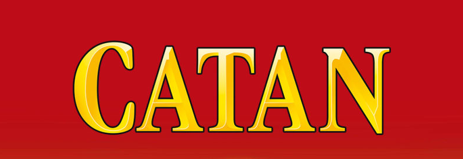
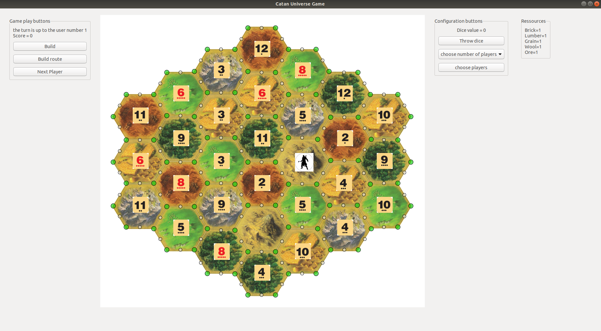
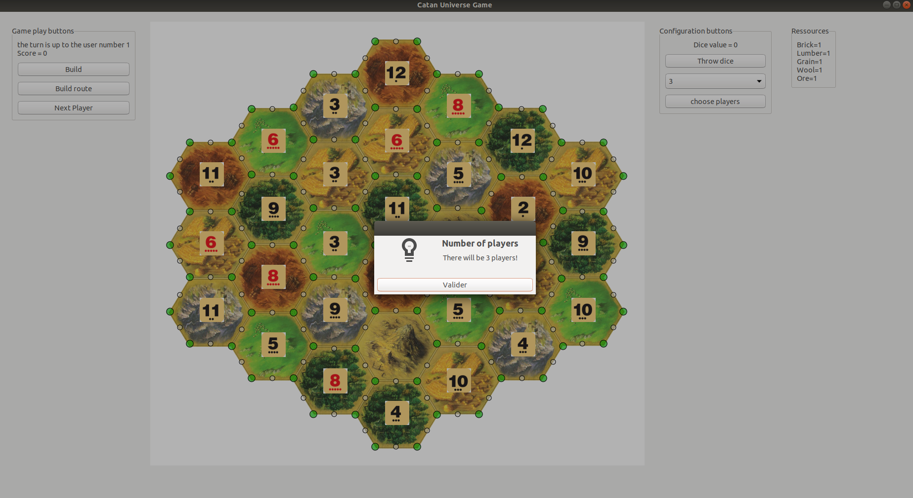
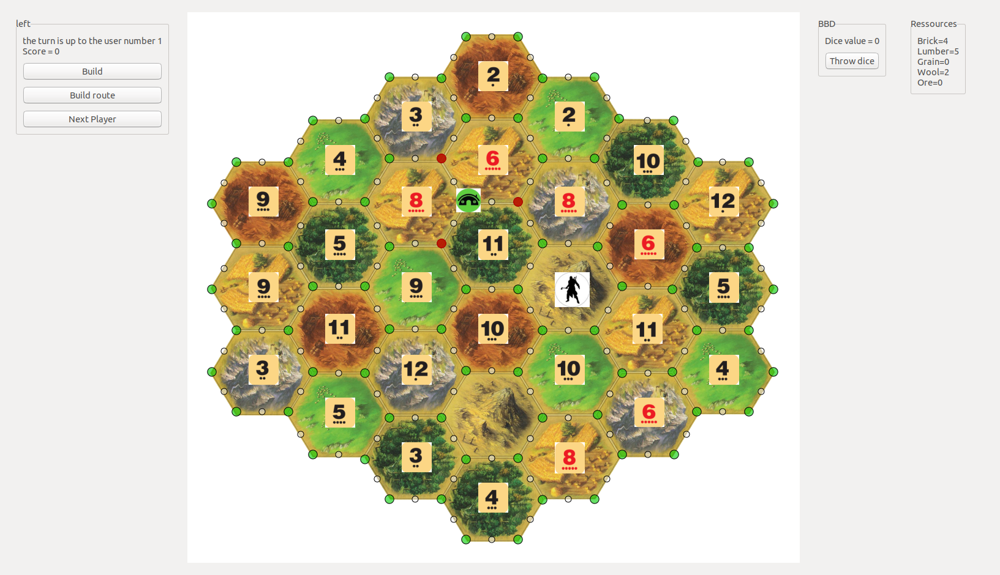
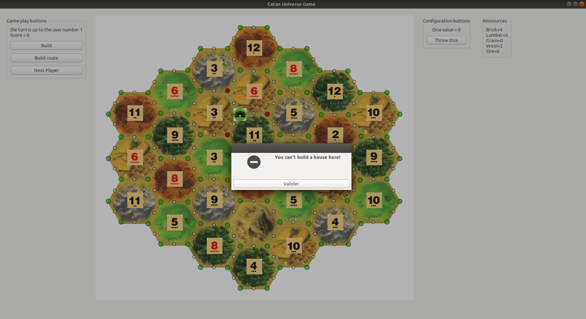
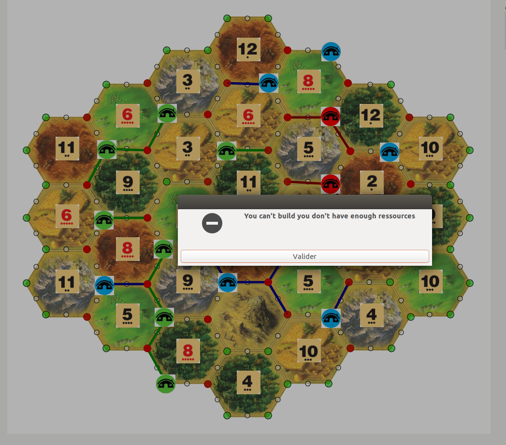
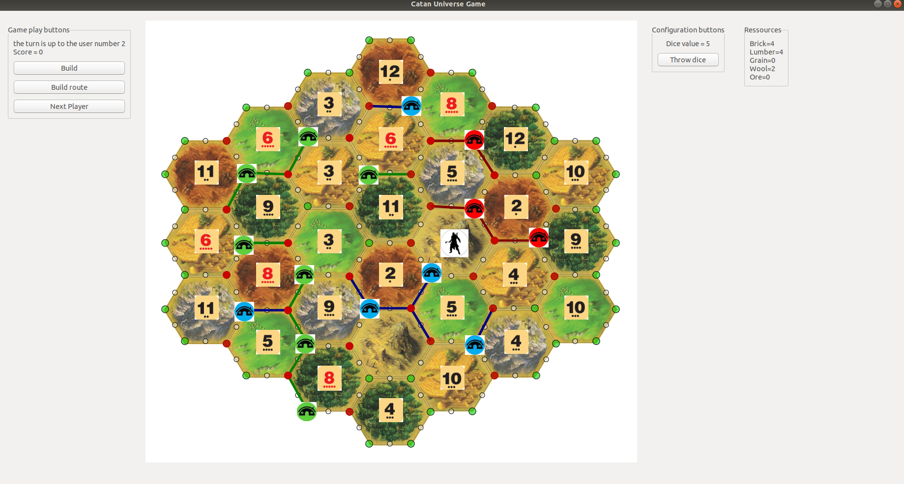

# Catan universe game
<!--
*** Thanks for checking out the Best-README-Template. If you have a suggestion
*** that would make this better, please fork the repo and create a pull request
*** or simply open an issue with the tag "enhancement".
*** Thanks again! Now go create something AMAZING! :D
-->


<!-- PROJECT SHIELDS -->
<!--
*** I'm using markdown "reference style" links for readability.
*** Reference links are enclosed in brackets [ ] instead of parentheses ( ).
*** See the bottom of this document for the declaration of the reference variables
*** for contributors-url, forks-url, etc. This is an optional, concise syntax you may use.
*** https://www.markdownguide.org/basic-syntax/#reference-style-links
-->
<!-- PROJECT LOGO -->
<br />
<p align="center">
  <a>
    
  </a>

  <h3 align="center" style="font-weight:bold">Implementation of catan universe game </h3>

  <p align="center">
    <span style="font-weight:bold; font-style:italic">with Gtkmm/C++</span> 
    <br /><br>
    <a href="https://www.catan.com/understand-catan/game-rules"><strong>Explore the rules of this game »</strong></a><br>
    <br />
    <br />

  </p>
</p>

<!-- ABOUT THE PROJECT -->
## About The Project
This project implements the Catan universe game using Gtkmm library in C++

### Built With

* [C++]() 
* [Gtkmm](https://gtkmm.org/en/)


<!-- GETTING STARTED -->
## Getting Started

To get a local copy up and running follow these simple steps

### 1. <span id="clone">Clone the repo</span>  
* Clone the repository locally

  ```sh
  git clone https://github.com/LouaiKB/Catan-universe-game.git
  
  cd Catan-universe-game
  ```
### 2. Start the app
* make sure that the library gtkmm is installed on your machine
to start the app, just tap on your terminal
   ```sh
    make; ./main
   ```
   <br>

<br><br> 


<!-- USAGE EXAMPLES -->
## Usage

### 1. <span id="compression">choose the number of players from combobox</span>

* Choose number of player than press on choose players button

<br>


## 2. <span id="decompression">Start the game</span>
* Click on a green point to build
<br>

<br>
The adjacent nodes of the builded node will be in red indicating that we will can't build a settlment on them
example: if we try to build on red nodes; we will get an error message dialog.
<br>

<br>
After each building the ressources frame will be updated according to the choosen node for building

* The three buttons correspond to the building process; you need to press on build for building settlments, build route for building routes and next player to switch to next player

* Note that if the player is running out of ressources (don't have enough ressources) the building process can't be done!


* Otherwise after each starting dice the player will gain ressources


## Important note
The backend of the project is 100% completed, all the functionnalities and the multiple components are completely coded (Check the code).
It remains to add some functionnalities to the front end to end up this beautiful project :)

<!-- CONTRIBUTING -->
## Contributing

Contributions are what make the open source community such an amazing place to be learn, inspire, and create. Any contributions you make are **greatly appreciated**.

1. Fork the Project
2. Create your Feature Branch (`git checkout -b feature/AmazingFeature`)
3. Commit your Changes (`git commit -m 'Add some AmazingFeature'`)
4. Push to the Branch (`git push origin feature/AmazingFeature`)
5. Open a Pull Request

on.


<!-- CONTACT -->
## Contact

louai.kassa-baghdouche@etu.univ-amu.fr


<!-- MARKDOWN LINKS & IMAGES -->
<!-- https://www.markdownguide.org/basic-syntax/
